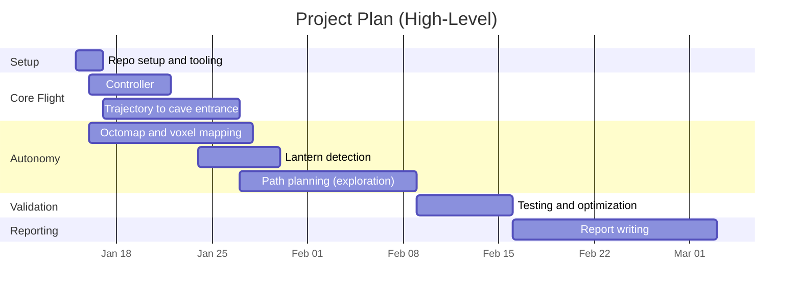
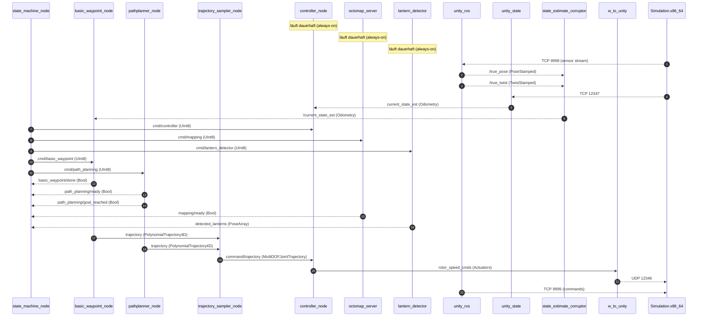
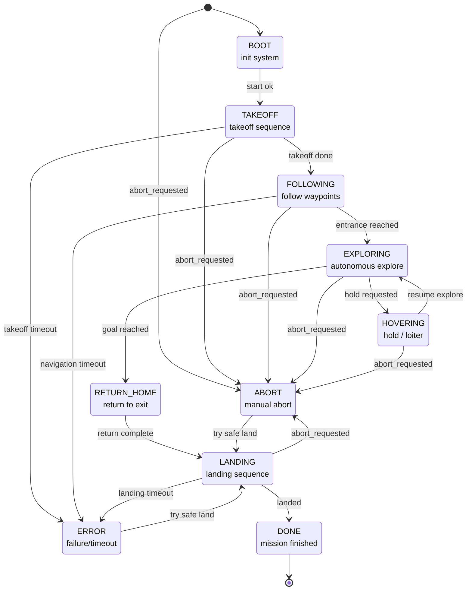
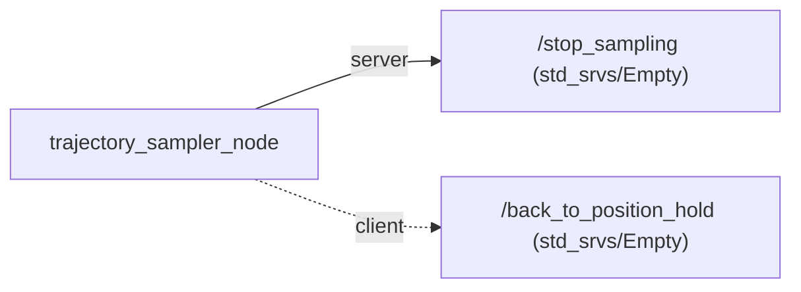
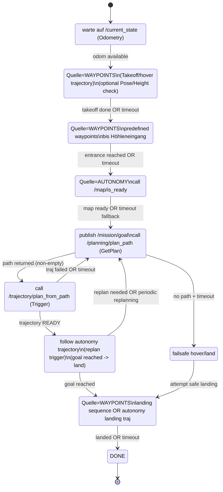

# [Autonomous Systems](https://sharelatex.tum.de/read/wchjfkvjgrcb#760f11): <br> Project Sub-Terrain Challenge (WS2025/26)

# Contents
- [1. Project Planning](#1-project-planning)
  - [1.1 Team](#11-team)
  - [1.2 Requirements](#12-requirements)
  - [1.3 Working Packages](#13-working-packages)
  - [1.4 Project Plan](#14-project-plan)
- [2. Setup & Structure](#2-setup--structure)
  - [2.1 Setup Guide](#21-setup-guide)
    - [2.1.0 Prerequisites](#210-prerequisites)
    - [2.1.1 Clone Repository](#211-clone-repository)
    - [2.1.2 Install & Setup VSCode](#212-install--setup-vscode)
    - [2.1.3 Install all missing packages](#213-install-all-missing-packages)
    - [2.1.4 Install & Setup ROS2 jazzy](#214-install--setup-ros2-jazzy)
    - [2.1.5 Download & Move Simulation](#215-download--move-simulation)
    - [2.1.6 Build Code](#216-build-code)
    - [2.1.7 Run Everything](#217-run-everything)
  - [2.2 Structure](#22-structure)
    - [2.2.1 Flow Chart](#221-flow-chart)
    - [2.2.2 Process Analysis](#222-process-analysis)
      - [2.2.2.1 Statemachine](#2221-statemachine)
    - [2.2.2 Thinking](#222-thinking)
      - [Ideas](#ideas)
      - [Overall Process Flow](#overall-process-flow)
- [3. Methodology](#3-methodology)
- [4. Results](#4-results)
- [Literature](#literature)

---

# 1. Project Planning


## 1.1 Team


| ID | Last Name | First Name | Matriculation number | Github Name |
|---:|-----------|------------|----------------------|-------------|
| 01 | Heller    | Leo        | N/A                  | LeoHeller   |
| 02 | Kitzbichler | Leon | N/A | lkitzbichler |
| 03 | Kristandra | Brian | N/A | N/A |
| 04 | Thimm | Dominik | N/A | dominik-thimm |
| 05 | Waeger | Sebastian | N/A | 03807001 |


## 1.2 Requirements

<details>
<summary>Show requirements</summary>

| ID | Requirement | Description | Acceptance Criteria |
|---:|-------------|-------------|---------------------|
| R1 | ROS2-based system | All nodes, packages, and orchestration are implemented in ROS2 Jazzy. | Project builds and runs in ROS2 Jazzy with all core nodes active. |
| R2 | Simulation integration | Unity simulation is integrated via the ROS2 bridge. | Simulation starts and exchanges state/command data with ROS2. |
| R3 | Controller implementation | A flight controller node executes commanded trajectories. | Controller consumes trajectory commands and outputs actuator commands. |
| R4 | Waypoint flight to cave | The drone flies to the cave entrance via defined waypoints. | The system reaches the entrance waypoint sequence reliably. |
| R5 | Autonomous exploration | The drone explores the cave using path planning. | Autonomous navigation continues beyond the entrance without manual control. |
| R6 | Mapping and voxel map | A voxel map (octomap) is built during exploration. | A 3D occupancy/voxel map is produced and visualizable. |
| R7 | Lantern detection and localization | Lanterns are detected and their positions are estimated. | Detected lantern poses are produced and logged. |
| R8 | Goal landing | The drone lands at the designated goal/exit point. | Mission ends with a controlled landing at the goal. |
| R9 | Team collaboration repo | The repository supports collaborative development. | Version control workflow is in place and documented. |
| R10 | One-command startup | The full system can be built and run from one entry point. | `build.bash` builds; `run.bash` launches the full system via launch files. |

</details>


## 1.3 Working Packages

<details>
<summary>Show work packages</summary>

The work packages below summarize responsibilities and scope. Each package includes research, integration, and testing tasks.

1. Repository setup  
   - Scope: initialize the shared repo, define structure, CI/lint basics, and contribution rules.  
   - Ownership: all team members, with one maintainer for merges.  
   - Includes: documentation, scripts (`build.bash`, `run.bash`), and launch orchestration.

2. Controller  
   - Scope: implement/port the low-level controller node and validate stable flight.  
   - Ownership: controller lead + integration support.  
   - Includes: parameter tuning, interface alignment, and simulation tests.

3. Trajectory to cave entrance  
   - Scope: waypoint-based flight to the cave entrance.  
   - Ownership: navigation lead.  
   - Includes: waypoint definition, trajectory generation, and validation runs.

4. Octomap and voxel mapping  
   - Scope: integrate octomap server and produce a voxel map.  
   - Ownership: mapping lead.  
   - Includes: sensor input wiring, map parameters, and visualization checks.

5. Lantern detection  
   - Scope: detect lanterns and estimate their positions.  
   - Ownership: perception lead.  
   - Includes: sensor processing, pose estimation, and logging.

6. Path planning for autonomous exploration  
   - Scope: enable autonomous navigation inside the cave.  
   - Ownership: planning lead.  
   - Includes: planner integration, safety checks, and mission validation.

7. Testing and optimization  
   - Scope: end-to-end validation, performance tuning, and stability fixes.  
   - Ownership: all leads, coordinated by test owner.  
   - Includes: regression tests, parameter sweeps, and reliability improvements.

8. Report writing  
   - Scope: document methods, results, and evaluation against requirements.  
   - Ownership: report lead with section owners.  
   - Includes: figures, tables, experiments, and final formatting.

</details>


## 1.4 Project Plan




---
# 2. Setup & Structure

## 2.1 Setup Guide


### 2.1.0 Prerequisites


```text
OS      :         Ubuntu 24.04
ROS     :         ROS2 Jazzy
ROS-DIR :         /opt/ros/jazzy
```

---

For use of git, successfull compilation of c++ and the use of python the following packages have to be installed:

```bash
sudo apt install -y git git-lfs curl build-essential
```

Install required ros2 packages
```bash
sudo apt install ros-jazzy-octomap-server ros-jazzy-pcl-ros ros-jazzy-depth-image-proc
```

### 2.1.1 Clone Repository

### 2.1.2 Install & Setup VSCode

### 2.1.3 Install all missing packages 

### 2.1.4 Install & Setup ROS2 jazzy

### 2.1.5 Download & Move Simulation

### 2.1.6 Build Code


Bash file should be executable already.
If not run:

```bash
chmod +x build.bash
```

When willing to finally build, run:

```bash
./build.bash
```


### 2.1.7 Run Everything


Bash file should be executable already.
If not run:

```bash
chmod +x run.bash
```

When willing to run the simulation and rest, run:

```bash
./run.bash
```


## 2.2 Structure 

### 2.2.1 Flow Chart

```mermaid
flowchart LR

  %% Layout: top row (left -> right)
  subgraph top_row[ ]
    direction LR

    subgraph statemachine_pkg
      state_machine[state_machine_node]
    end

    subgraph lantern_detector_pkg
      detector[lantern_detector]
    end

    subgraph mapping_pkg
      octomap_server["octomap_server (octomap_server_node)"]
    end

    subgraph path_planning_pkg
      path_planner["path_planner (pathplanner_node)"]
    end

    subgraph basic_waypoint_pkg
      planner["planner (basic_waypoint_node)"]
    end

    subgraph mav_trajectory_generation
      sampler[trajectory_sampler_node]
    end

    subgraph controller_pkg
      controller[controller_node]
    end
  end

  %% Layout: bottom row
  subgraph bottom_row[ ]
    direction LR

    subgraph simulation
      unity_ros[unity_ros]
      unity_state[unity_state]
      w_to_unity[w_to_unity]
      state_estimate_corruptor[state_estimate_corruptor_node]
      sim_exec["Simulation (Simulation.x86_64)"]
    end

    %% Given Packages
    subgraph mav_msgs
      note1[pure UAV controll message type definition]
    end

    subgraph mav_planning_msgs
      note2[pure trajectory, waypoint and marker message type definitions]
    end

    subgraph unused_topics
      unused[(Unused/Visualization Topics)]
    end
  end

  %% Connections (topics from statemachine)
  state_machine -- "statemachine/cmd/basic_waypoint (std_msgs/UInt8)" --> planner
  planner -- "basic_waypoint/done (std_msgs/Bool)" --> state_machine

  state_machine -- "statemachine/cmd/path_planning (std_msgs/UInt8)" --> path_planner
  path_planner -- "path_planning/ready (std_msgs/Bool)" --> state_machine
  path_planner -- "path_planning/goal_reached (std_msgs/Bool)" --> state_machine

  state_machine -- "statemachine/cmd/mapping (std_msgs/UInt8)" --> octomap_server
  octomap_server -- "mapping/ready (std_msgs/Bool)" --> state_machine

  state_machine -- "statemachine/cmd/controller (std_msgs/UInt8)" --> controller

  state_machine -- "statemachine/cmd/lantern_detector (std_msgs::UInt8)" --> detector
  detector -- "detected_lanterns (geometry_msgs::msg::PoseArray)" --> state_machine

  %% Unterbefehle

  planner -- "trajectory (mav_planning_msgs::msg::PolynomialTrajectory4D)" --> sampler

  path_planner -- "trajectory (mav_planning_msgs::msg::PolynomialTrajectory4D)" --> sampler

  sampler -- "command/trajectory (trajectory_msgs::msg::MultiDOFJointTrajectory)" --> controller

  %% Weitere Verbindungen (Sensor/State)
  unity_ros -- "/true_pose (geometry_msgs::msg::PoseStamped)" --> state_estimate_corruptor
  unity_ros -- "/true_twist (geometry_msgs::msg::TwistStamped)" --> state_estimate_corruptor
  state_estimate_corruptor -- "/current_state_est (nav_msgs::msg::Odometry)" --> planner
  unity_state -- "current_state_est (nav_msgs::msg::Odometry)" --> controller
  controller -- "rotor_speed_cmds (mav_msgs::msg::Actuators)" --> w_to_unity
  w_to_unity -. "UDP 12346" .-> sim_exec
  sim_exec -. "TCP 12347" .-> unity_state
  sim_exec -. "TCP 9998 (sensor stream)" .-> unity_ros
  unity_ros -. "TCP 9999 (commands)" .-> sim_exec

  %% Topics not consumed in this repo (visualization/unused here)
  planner -- "trajectory_markers (visualization_msgs::msg::MarkerArray)" --> unused
  unity_ros -- "/realsense/rgb/left_image_raw (sensor_msgs::msg::Image)" --> unused
  unity_ros -- "/realsense/rgb/right_image_raw (sensor_msgs::msg::Image)" --> unused
  unity_ros -- "/realsense/depth/image (sensor_msgs::msg::Image)" --> unused
  unity_ros -- "/interpolate_imu/imu (sensor_msgs::msg::Imu)" --> unused
  state_estimate_corruptor -- "/pose_est (geometry_msgs::msg::PoseStamped)" --> unused
  state_estimate_corruptor -- "/twist_est (geometry_msgs::msg::TwistStamped)" --> unused
  state_machine -- "statemachine/state (std_msgs::msg::String)" --> unused

  octomap_server -- "octomap_binary (octomap_msgs::msg::Octomap)" --> unused
  octomap_server -- "octomap_full (octomap_msgs::msg::Octomap)" --> unused
  octomap_server -- "octomap_markers (visualization_msgs::msg::MarkerArray)" --> unused

  %% Link styling (GitHub + VSCode Mermaid)
  %% 0,2,5,7,8 = commands from statemachine
  %% 1,3,4,6,9 = feedback to statemachine
  linkStyle 0,2,5,7,8 stroke:#e53935,stroke-width:2px
  linkStyle 1,3,4,6,9 stroke:#1e88e5,stroke-width:2px
  linkStyle 10,11 stroke:#5a00ba,stroke-width:2px
  linkStyle 12 stroke:#ba0063,stroke-width:2px
  linkStyle 22,23,24,25,26,27,28,29,30,31,32 stroke:#9e9e9e,stroke-width:1px,stroke-dasharray:4 3

```



### 2.2.2 Process Analysis

#### 2.2.2.1 Statemachine

##### Sequence Diagram


##### State Diagram


### 2.2.2 Thinking

#### Ideas



#### Overall Process Flow



---

# Literature
