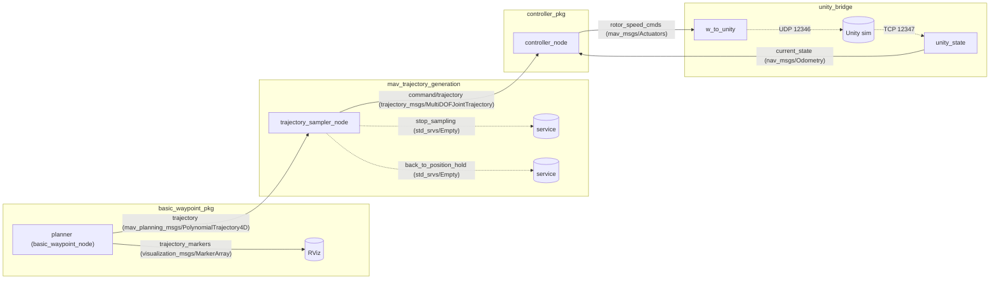
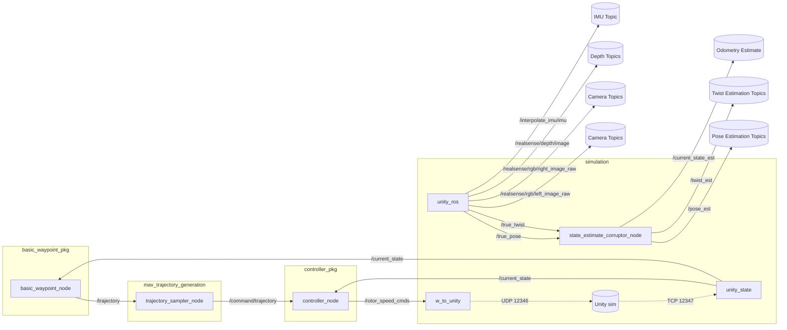
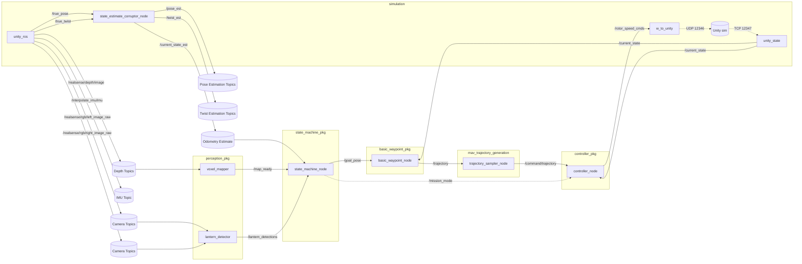
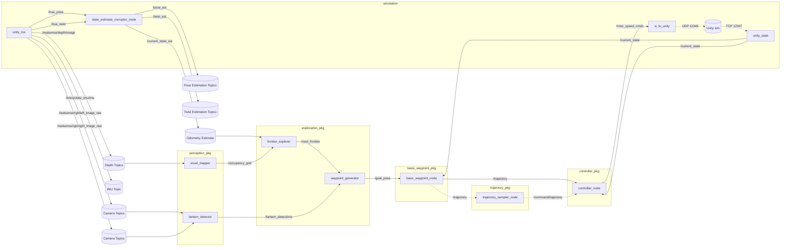
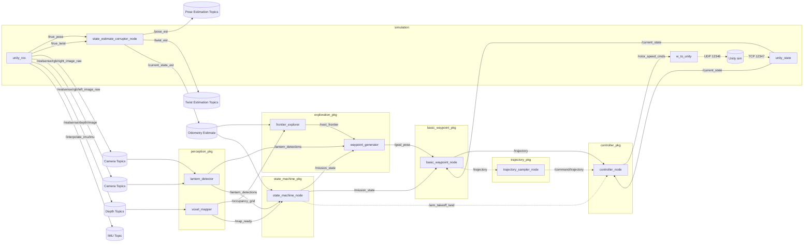
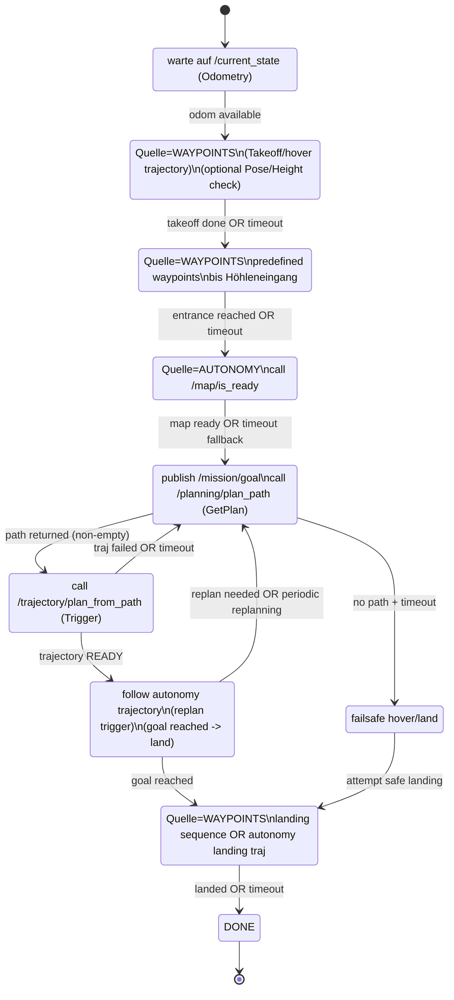
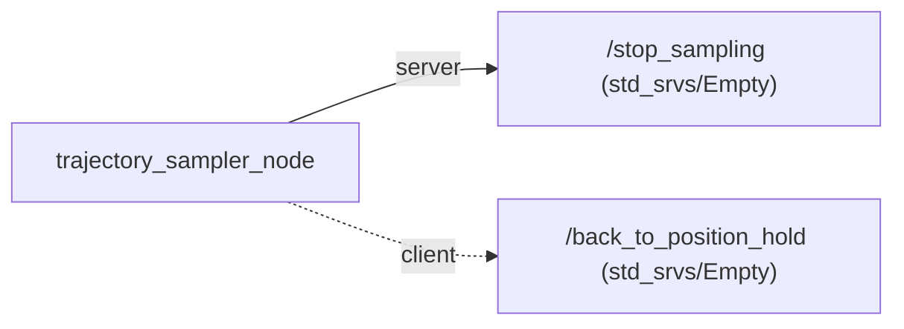

# [Autonomous Systems](https://sharelatex.tum.de/read/wchjfkvjgrcb#760f11): <br> Project Sub-Terrain Challenge (WS2025/26)

# Contents
- [1. Project Planning](#1-project-planning)
  - [1.1 Team](#11-team)
  - [1.2 Requirements](#12-requirements)
  - [1.3 Working Packages](#13-working-packages)
  - [1.4 Project Plan](#14-project-plan)
- [2. Setup & Structure](#2-setup--structure)
    - [2.1 Setup Guide](#21-setup-guide)
      - [2.1.1 Prerequisites](#210-prerequisites)
      - [2.1.1 Clone Repository](#211-clone-repository)
      - [2.1.2 Install & Setup VSCode](#212-install--setup-vscode)
      - [2.1.3 Install missing packages](#213-install-all-missing-packages)
      - [2.1.4 Install & Setup ROS2 jazzy](#214-install--setup-ros2-jazzy)
      - [2.1.5 Download & Move Simulation](#215-download--move-simulation)
      - [2.1.6 Build Code](#216-build-code)
      - [2.1.7 Run Everything](#217-run-everything)
    - [2.2 Structure Planning](#22-structure-planning)
        - [2.2.1 Ros2-Nodes](#221-ros2-nodes)
        - [2.2.2 Ros2-Packages](#222-ros2-packages)
- [3. Methodology](#3-methodology)
- [4. Results](#4-results)
- [Literature](#literature)

---

# 1. Project Planning

<details>
<summary> Show Sub chapters </summary>

## 1.1 Team

<details>

| ID | Last Name | First Name | Matriculation number | Github Name |
|---:|-----------|------------|----------------------|-------------|
| 01 | Heller    | Leo        | N/A                  | LeoHeller   |
| 02 | Kitzbichler | Leon | N/A | lkitzbichler |
| 03 | Kristandra | Brian | N/A | N/A |
| 04 | Thimm | Dominik | N/A | dominik-thimm |
| 05 | Waeger | Sebastian | N/A | 03807001 |

</details>

## 1.2 Requirements

<details>


</details>

## 1.3 Working Packages

<details>


</details>

## 1.4 Project Plan

<details>


</details>

</details>

---
# 2. Setup & Structure

<details>
<summary> Show Sub chapters </summary>

## 2.1 Setup Guide

<details>

### 2.1.0 Prerequisites

<details>

```text
OS      :         Ubuntu 24.04
ROS     :         ROS2 Jazzy
ROS-DIR :         /opt/ros/jazzy
```

---

For use of git, successfull compilation of c++ and the use of python the following packages have to be installed:

```bash
sudo apt install -y git git-lfs curl build-essential
```

Install required ros2 packages
```bash
sudo apt install ros-jazzy-octomap-server ros-jazzy-pcl-ros ros-jazzy-depth-image-proc
```
</details>

### 2.1.1 Clone Repository

### 2.1.2 Install & Setup VSCode

### 2.1.3 Install all missing packages 

### 2.1.4 Install & Setup ROS2 jazzy

### 2.1.5 Download & Move Simulation

### 2.1.6 Build Code

<details>

Bash file should be executable already.
If not run:

```bash
chmod +x build.bash
```

When willing to finally build, run:

```bash
./build.bash
```

</details>

### 2.1.7 Run Everything

<details>

Bash file should be executable already.
If not run:

```bash
chmod +x run.bash
```

When willing to run the simulation and rest, run:

```bash
./run.bash
```

</details>

</details>

## 2.2 Structure Planning

<details>
<summary>Trajectory Assignment Plan</summary>



</details>

### 2.2.1 Structure Plans

```mermaid
flowchart LR

  %% Layout: top row (left -> right)
  subgraph top_row[ ]
    direction LR

    subgraph statemachine_pkg
      state_machine[state_machine_node]
    end

    subgraph detection_pkg
      detector[detector_node]
    end

    subgraph mapping_pkg
      octomap_server["octomap_server (octomap_server_node)"]
    end

    subgraph path_planning_pkg
      path_planner["path_planner (pathplanner_node)"]
    end

    subgraph basic_waypoint_pkg
      planner["planner (basic_waypoint_node)"]
    end

    subgraph mav_trajectory_generation
      sampler[trajectory_sampler_node]
    end

    subgraph controller_pkg
      controller[controller_node]
    end
  end

  %% Layout: bottom row
  subgraph bottom_row[ ]
    direction LR

    subgraph simulation
      unity_ros[unity_ros]
      unity_state[unity_state]
      w_to_unity[w_to_unity]
      state_estimate_corruptor[state_estimate_corruptor_node]
      sim_exec["Simulation (Simulation.x86_64)"]
    end

    %% Given Packages
    subgraph mav_msgs
      note1[pure UAV controll message type definition]
    end

    subgraph mav_planning_msgs
      note2[pure trajectory, waypoint and marker message type definitions]
    end

    subgraph unused_topics
      unused[(Unused/Visualization Topics)]
    end
  end

  %% Connections (topics from statemachine)
  state_machine -- "statemachine/cmd/basic_waypoint (std_msgs/UInt8)" --> planner
  planner -- "basic_waypoint/done (std_msgs/Bool)" --> state_machine

  state_machine -- "statemachine/cmd/path_planning (std_msgs/UInt8)" --> path_planner
  path_planner -- "path_planning/ready (std_msgs/Bool)" --> state_machine
  path_planner -- "path_planning/goal_reached (std_msgs/Bool)" --> state_machine

  state_machine -- "statemachine/cmd/mapping (std_msgs/UInt8)" --> octomap_server
  octomap_server -- "mapping/ready (std_msgs/Bool)" --> state_machine

  state_machine -- "statemachine/cmd/controller (std_msgs/UInt8)" --> controller

  state_machine -- "statemachine/lantern_target (geometry_msgs::msg::PoseStamped)" --> detector
  state_machine -- "statemachine/lanterns (geometry_msgs::msg::PoseArray)" --> detector
  detector -- "detection/lantern (geometry_msgs::msg::PoseStamped)" --> state_machine

  %% Unterbefehle

  planner -- "trajectory (mav_planning_msgs::msg::PolynomialTrajectory4D)" --> sampler

  path_planner -- "trajectory (mav_planning_msgs::msg::PolynomialTrajectory4D)" --> sampler

  sampler -- "command/trajectory (trajectory_msgs::msg::MultiDOFJointTrajectory)" --> controller

  %% Weitere Verbindungen (Sensor/State)
  unity_ros -- "/true_pose (geometry_msgs::msg::PoseStamped)" --> state_estimate_corruptor
  unity_ros -- "/true_twist (geometry_msgs::msg::TwistStamped)" --> state_estimate_corruptor
  state_estimate_corruptor -- "/current_state_est (nav_msgs::msg::Odometry)" --> planner
  unity_state -- "current_state (nav_msgs::msg::Odometry)" --> controller
  controller -- "rotor_speed_cmds (mav_msgs::msg::Actuators)" --> w_to_unity
  w_to_unity -. "UDP 12346" .-> sim_exec
  sim_exec -. "TCP 12347" .-> unity_state
  sim_exec -. "TCP 9998 (sensor stream)" .-> unity_ros
  unity_ros -. "TCP 9999 (commands)" .-> sim_exec

  %% Topics not consumed in this repo (visualization/unused here)
  planner -- "trajectory_markers (visualization_msgs::msg::MarkerArray)" --> unused
  unity_ros -- "/realsense/rgb/left_image_raw (sensor_msgs::msg::Image)" --> unused
  unity_ros -- "/realsense/rgb/right_image_raw (sensor_msgs::msg::Image)" --> unused
  unity_ros -- "/realsense/depth/image (sensor_msgs::msg::Image)" --> unused
  unity_ros -- "/interpolate_imu/imu (sensor_msgs::msg::Imu)" --> unused
  state_estimate_corruptor -- "/pose_est (geometry_msgs::msg::PoseStamped)" --> unused
  state_estimate_corruptor -- "/twist_est (geometry_msgs::msg::TwistStamped)" --> unused
  state_machine -- "statemachine/state (std_msgs::msg::String)" --> unused

  %% Link styling (GitHub + VSCode Mermaid)
  %% 0,2,5,7,8,9 = commands from statemachine
  %% 1,3,4,6,10 = feedback to statemachine
  linkStyle 0,2,5,7,8,9 stroke:#e53935,stroke-width:2px
  linkStyle 1,3,4,6,10 stroke:#1e88e5,stroke-width:2px
  linkStyle 11,12 stroke:#5a00ba,stroke-width:2px
  linkStyle 13 stroke:#ba0063,stroke-width:2px
  linkStyle 23,24,25,26,27,28,29,30 stroke:#9e9e9e,stroke-width:1px,stroke-dasharray:4 3

```

<details>
<summary>Final Flow Chart</summary>



</details>

<details>

<details>
<summary>Stand 2026-01-17</summary>



</details>

<details>
<summary>V2</summary>



</details>

<details>
<summary>V3</summary>



</details>

<details>
<summary>V4</summary>



</details>

</details>

### 2.2.2 Processes

#### 2.2.2.1 Statemachine

<details>
<summary>Linear Thoughts</summary>



</details>

<details>
<summary>Place in overall view</summary>



</details>

```mermaid
flowchart LR

  %% -------------------------
  %% Legend
  %% -------------------------
  subgraph LEGEND["Legende"]
    L1["Topic"]:::topic
    L2["Service"]:::service
    L3["Node"]:::node
    L4["Package"]:::pkg
  end

  classDef pkg fill:#f6f6f6,stroke:#999,stroke-width:1px;
  classDef node fill:#ffffff,stroke:#333,stroke-width:1px;
  classDef topic fill:#e8f3ff,stroke:#1b66c9,stroke-width:1px;
  classDef service fill:#fff0e6,stroke:#d26a00,stroke-width:1px;

  %% =========================
  %% Simulation / Bridge
  %% =========================
  subgraph P_SIM["simulation_bridge_pkg"]
    N_SIM["simulation_bridge_node"]:::node
  end
  class P_SIM pkg;

  T_ODOM["/current_state\nnav_msgs/Odometry"]:::topic
  T_DEPTH["/realsense/depth/image\nsensor_msgs/Image"]:::topic
  T_CINFO["/realsense/depth/camera_info\nsensor_msgs/CameraInfo"]:::topic
  T_ACT["/rotor_speed_cmds\nmav_msgs/Actuators"]:::topic

  N_SIM --> T_ODOM
  N_SIM --> T_DEPTH
  N_SIM --> T_CINFO
  T_ACT --> N_SIM

  %% =========================
  %% Perception: depth -> cloud
  %% =========================
  subgraph P_PER["perception_pkg (depth_image_proc)"]
    N_D2C["depth_to_cloud_node"]:::node
  end
  class P_PER pkg;

  T_PCL["/perception/depth/points\nsensor_msgs/PointCloud2"]:::topic

  T_DEPTH --> N_D2C
  T_CINFO --> N_D2C
  N_D2C --> T_PCL

  %% =========================
  %% Mapping: OctoMap
  %% =========================
  subgraph P_MAP["octomap_mapping_pkg"]
    N_MAP["octomap_mapping_node"]:::node
  end
  class P_MAP pkg;

  T_OCTO["/map/octomap_binary\noctomap_msgs/Octomap"]:::topic
  T_OCTO_FULL["/map/octomap_full (optional)\noctomap_msgs/Octomap"]:::topic
  T_MAPVIS["/map/occupied_cells_vis (optional)\nMarkerArray"]:::topic

  S_MAP_READY["/map/is_ready\nstd_srvs/Trigger"]:::service
  S_MAP_RESET["/map/reset\nstd_srvs/Empty"]:::service

  T_PCL --> N_MAP
  N_MAP --> T_OCTO
  N_MAP --> T_OCTO_FULL
  N_MAP --> T_MAPVIS
  N_MAP --- S_MAP_READY
  N_MAP --- S_MAP_RESET

  %% =========================
  %% Path Planning: A* on OctoMap
  %% =========================
  subgraph P_PLAN["path_planner_pkg"]
    N_ASTAR["path_planner_astar_octomap_node"]:::node
  end
  class P_PLAN pkg;

  S_GETPLAN["/planning/plan_path\nnav_msgs/GetPlan"]:::service
  T_PATH["/planning/path\nnav_msgs/Path"]:::topic
  T_PSTATUS["/planning/status\nstd_msgs/String"]:::topic

  T_OCTO --> N_ASTAR
  T_ODOM --> N_ASTAR
  N_ASTAR --- S_GETPLAN
  N_ASTAR --> T_PATH
  N_ASTAR --> T_PSTATUS

  %% =========================
  %% Trajectory Planning: mav_trajectory_generation
  %% =========================
  subgraph P_TRAJPLAN["trajectory_planner_pkg"]
    N_TRAJPLAN["path_trajectory_planner_node"]:::node
  end
  class P_TRAJPLAN pkg;

  S_PLANTRAJ["/trajectory/plan_from_path\nstd_srvs/Trigger"]:::service
  T_TSTATUS["/trajectory/status\nstd_msgs/String"]:::topic
  T_TRAJ_AUTO["/trajectory_autonomy\nmav_planning_msgs/PolynomialTrajectory4D"]:::topic
  T_TRAJ_AUTO_MARK["/trajectory_markers_autonomy (optional)\nMarkerArray"]:::topic

  T_PATH --> N_TRAJPLAN
  N_TRAJPLAN --- S_PLANTRAJ
  N_TRAJPLAN --> T_TRAJ_AUTO
  N_TRAJPLAN --> T_TSTATUS
  N_TRAJPLAN --> T_TRAJ_AUTO_MARK

  %% =========================
  %% Waypoint Planner (existing)
  %% =========================
  subgraph P_WP["basic_waypoint_pkg"]
    N_WP["basic_waypoint_node (BasicPlanner)"]:::node
  end
  class P_WP pkg;

  T_TRAJ_WP["/trajectory_waypoints\nmav_planning_msgs/PolynomialTrajectory4D"]:::topic
  T_WP_MARK["/trajectory_markers (optional)\nMarkerArray"]:::topic

  T_ODOM --> N_WP
  N_WP --> T_TRAJ_WP
  N_WP --> T_WP_MARK

  %% =========================
  %% Trajectory Mux
  %% =========================
  subgraph P_MUX["trajectory_mux_pkg"]
    N_MUX["trajectory_mux_node"]:::node
  end
  class P_MUX pkg;

  T_SRC["/mission/trajectory_source\nstd_msgs/String (WAYPOINTS|AUTONOMY)"]:::topic
  T_TRAJ["/trajectory\nmav_planning_msgs/PolynomialTrajectory4D"]:::topic

  T_TRAJ_WP --> N_MUX
  T_TRAJ_AUTO --> N_MUX
  T_SRC --> N_MUX
  N_MUX --> T_TRAJ

  %% =========================
  %% Trajectory Sampler
  %% =========================
  subgraph P_SAMPLER["trajectory_sampler_pkg"]
    N_SAMPLER["trajectory_sampler_node"]:::node
  end
  class P_SAMPLER pkg;

  T_CMD["/command/trajectory\ntrajectory_msgs/MultiDOFJointTrajectory"]:::topic
  T_TRACK["/tracking/status (recommended)\nstd_msgs/String"]:::topic

  T_TRAJ --> N_SAMPLER
  N_SAMPLER --> T_CMD
  N_SAMPLER --> T_TRACK

  %% =========================
  %% Controller
  %% =========================
  subgraph P_CTRL["controller_pkg"]
    N_CTRL["controller_node"]:::node
  end
  class P_CTRL pkg;

  T_CMD --> N_CTRL
  T_ODOM --> N_CTRL
  N_CTRL --> T_ACT

  %% =========================
  %% Mission Manager / State Machine
  %% =========================
  subgraph P_MM["mission_manager_pkg"]
    N_MM["mission_manager_node (State Machine)"]:::node
  end
  class P_MM pkg;

  T_GOAL["/mission/goal\ngeometry_msgs/PoseStamped"]:::topic
  T_MODE["/mission/mode\nstd_msgs/String"]:::topic

  T_ODOM --> N_MM
  T_TRACK --> N_MM
  N_MM --> T_SRC
  N_MM --> T_GOAL
  N_MM --> T_MODE

  N_MM --- S_MAP_READY
  N_MM --- S_GETPLAN
  N_MM --- S_PLANTRAJ

  T_GOAL --> N_ASTAR

```

### 2.2.2 Ros2-Packages

<details>


</details>

### 2.2.3 Ros2-Services

<details>



</details>

</details>


---
# 3. Methodology

<details>


</details>

---
# 4. Results

<details>


</details>

---
# Literature

<details>


</details>
