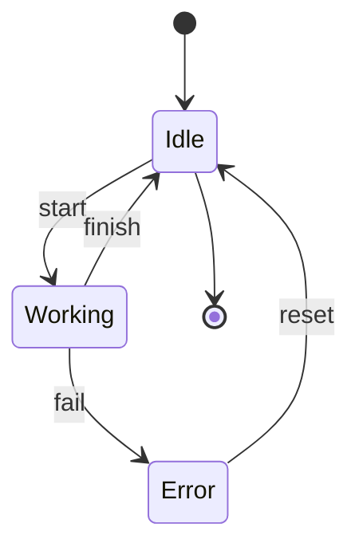

# [Autonomous Systems](https://sharelatex.tum.de/project/69692203c9cf534f5a08821c):   Project Sub-Terrain Challenge (WS2025/26)

# Contents
- [1. Project Planning](#1-project-planning)
  - [1.1 Team](#11-team)
  - [1.2 Requirements]()
  - [1.3 Working Packages]()
  - [1.4 Project Plan]()
- [2. Setup & Structure]()
    - [2.1 Setup Guide]()
    - [2.2 Structure Planning]()
        - [2.2.1 Ros2-Nodes]()
        - [2.2.2 Ros2-Packages]()
- [3. Methodology]()
- [4. Results]()
- [Literature]()

---

# 1. Project Planning
## 1.1 Team

| ID | Last Name | First Name | Matriculation number | Github Name |
|---:|-----------|------------|----------------------|-------------|
| 01 | Heller    | Leo        | N/A                  | LeoHeller   |
| 02 | Kitzbichler | Leon | N/A | lkitzbichler |
| 03 | Kristandra | Brian | N/A | N/A |
| 04 | Thimm | Dominik | N/A | dominik-thimm |
| 05 | Waeger | Sebastian | N/A | 03807001 |

## 1.2 Requirements
## 1.3 Working Packages
## 1.4 Project Plan
---
# 2. Setup & Structure
## 2.1 Setup Guide
## 2.2 Structure Planning
### 2.2.1 Ros2-Nodes

### 2.2.2 Ros2-Packages
---
---
# 3. Methodology
---
# 4. Results
---
# Literature