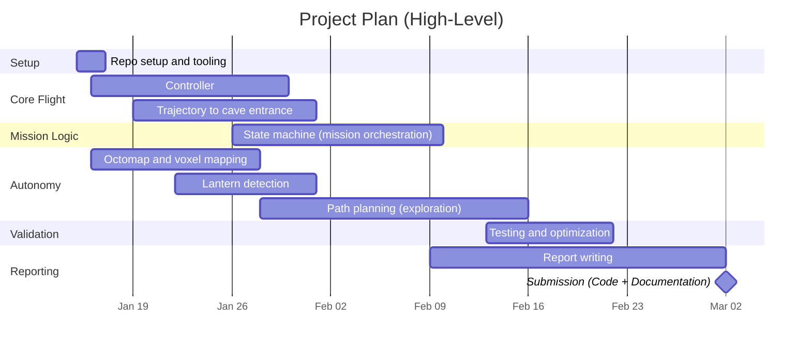
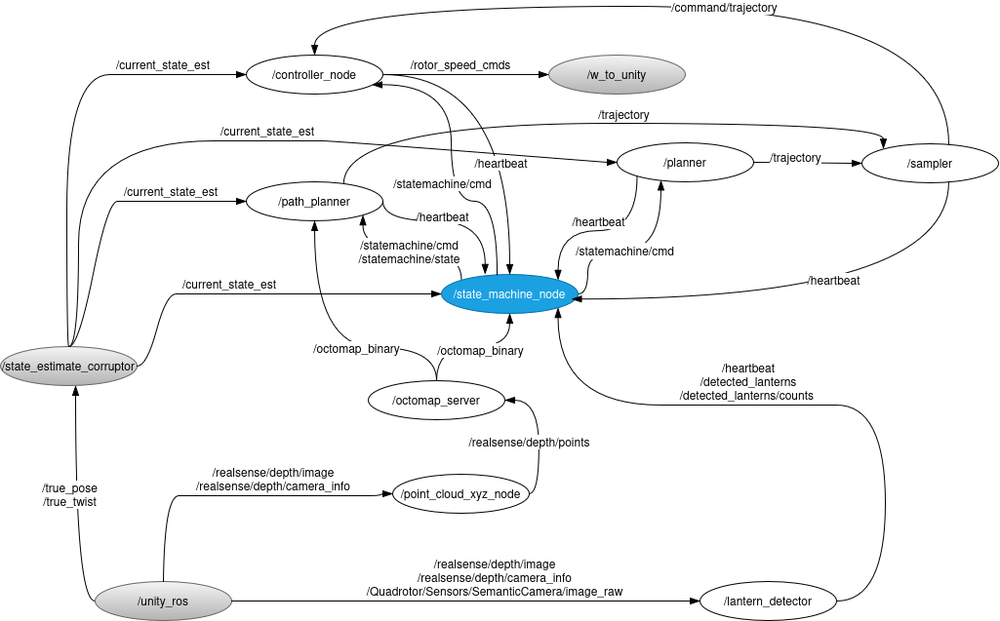
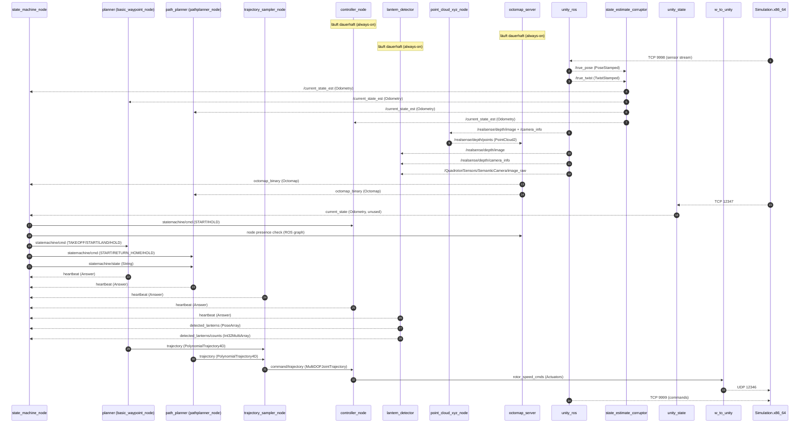
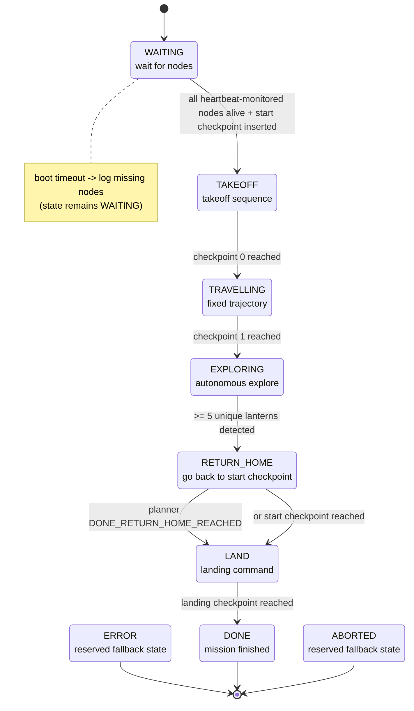

# Autonomous Systems: <br> Project Sub-Terrain Challenge (WS2025/26)

# Contents

- [1. Setup & Usage](#1-setup--usage)
  - [1.1 Installation & Launch Guide](#11-setup--run-guide)
    - [1.1.0 Prerequisites](#110-prerequisites)
    - [1.1.1 Setup](#111-setup)
      - [1. Installation of git and git-lfs](#1-installation-of-git-and-git-lfs)
      - [2. Installation of ROS2 Jazzy](#2-installation-of-ros2-jazzy)
      - [3. Installation of build essentials](#3-installation-of-build-essentials)
      - [4. Installation of Unity](#4-installation-of-unity)
    - [1.1.2 Clone Repository (ssh)](#112-clone-repository-ssh)
    - [1.1.3 Install & Setup VSCode](#113-install--setup-vscode)
    - [1.1.4 Paste Simulation](#114-paste-simulation)
    - [1.1.5 Build Code](#115-build-code)
    - [1.1.6 Run Everything](#116-run-everything)
  - [1.2 Usage & Opening of Voxel Map](#12-usage--opening-of-voxel-map)
    - [1.2.1 Tips for usage](#121-tips-for-usage)
    - [1.2.2 Open the voxelmap](#122-open-the-voxelmap)
- [2. Project Planning](#2-project-planning)
  - [2.1 Team](#21-team)
  - [2.2 Requirements](#22-requirements)
  - [2.3 Working Packages](#23-working-packages)
  - [2.4 Project Plan](#24-project-plan)
- [3 Structure](#3-structure)
  - [3.1 ROS-Graph](#31-ROS-Graph)
  - [3.2 Process Analysis](#32-process-analysis)
    - [3.2.1 Statemachine](#321-statemachine)
      - [Sequence Diagram](#sequence-diagram)
      - [State Diagram](#state-diagram)
- [Literature](#literature)

---

The Project report can be downloaded [here.](docs/Autonomous_Systems_Documentation_GR04.pdf)

---
# 1. Setup & Usage

## 1.1 Installation & Launch Guide

### 1.1.0 Prerequisites
>[!WARNING]
>The Solution operates differently at different performances of computers.
>Virtual machines should not be used!
>Furthermore there will be more packages installed by running the build.bash file

```text
OS      :         Ubuntu 24.04.4 LTS
ROS     :         ROS2 Jazzy
ROS-DIR :         /opt/ros/jazzy
UNITY-Version:    6.2

MIN Tested Requirements: 
CPU:              AMD Ryzen 5 8645HS
GRAPHICS:         AMD Radeon 760M Graphics x 12
RAM:              16 GB
FREE SPACE:       100 GB
```

---
### 1.1.1 Setup

For a successful setup in order to run everything please follow these instructions!

For use of git, python, ros2 and a successfull compilation of c++ the following packages have to be installed:

#### 1. Installation of git and git-lfs
```bash
sudo apt install -y git git-lfs
git lfs install
```

#### 2. Installation of ROS2 Jazzy
1. Setup locale for ROS2 and python
```bash
sudo apt update
sudo apt install -y locales software-properties-common
sudo locale-gen en_US en_US.UTF-8
sudo update-locale LC_ALL=en_US.UTF-8 LANG=en_US.UTF-8
export LANG=en_US.UTF-8

sudo add-apt-repository universe
sudo apt update
```

2. Add ROS2 Jazzy repo for installation
```bash
sudo apt install -y curl ca-certificates gnupg lsb-release
sudo mkdir -p /etc/apt/keyrings

curl -sSL https://raw.githubusercontent.com/ros/rosdistro/master/ros.key \
  | sudo gpg --dearmor -o /etc/apt/keyrings/ros-archive-keyring.gpg

echo "deb [arch=$(dpkg --print-architecture) signed-by=/etc/apt/keyrings/ros-archive-keyring.gpg] http://packages.ros.org/ros2/ubuntu $(. /etc/os-release && echo $UBUNTU_CODENAME) main" \
  | sudo tee /etc/apt/sources.list.d/ros2.list > /dev/null

sudo apt update
```

3. Install ROS2 Jazzy and rviz2
```bash
sudo apt install -y ros-jazzy-desktop ros-jazzy-rviz2
```

#### 3. Installation of build essentials
```bash
sudo apt install -y curl build-essential cmake gdb python3-colcon-common-extensions python3-rosdep python3-vcstool
sudo rosdep init 2>/dev/null || true
rosdep update
```

#### 4. Installation of Unity
Install **Unity Hub**, then install the required **Unity Editor version** for this project.

1. Download and install Unity Hub
```bash
sudo apt update
sudo apt install -y curl ca-certificates gnupg

sudo install -d /etc/apt/keyrings
curl -fsSL https://hub.unity3d.com/linux/keys/public \
  | sudo gpg --dearmor -o /etc/apt/keyrings/unityhub.gpg

echo "deb [signed-by=/etc/apt/keyrings/unityhub.gpg] https://hub.unity3d.com/linux/repos/deb stable main" \
  | sudo tee /etc/apt/sources.list.d/unityhub.list > /dev/null

sudo apt update
sudo apt install -y unityhub
```

2. In Unity Hub → **Installs** → **Install Editor**
3. Install **Unity Editor <VERSION>** (plus optional modules you need, e.g. Windows/Linux Build Support)
4. Open the project by selecting the repository folder in Unity Hub (**Add** → select repo root)

<!-- Install required ros2 packages
```bash
sudo apt install ros-jazzy-octomap-server ros-jazzy-pcl-ros ros-jazzy-depth-image-proc octovis
``` -->

### 1.1.2 Clone Repository
```bash
git clone https://github.com/lkitzbichler/Autonomous-Systems-Sub-Terrain-Challenge-GR04.git
```

### 1.1.3 Install & Setup VSCode

If you want to view the code correctly make shure to open the Workspace and install all recommended extensions.

### 1.1.4 Paste Simulation

1. [Download](https://syncandshare.lrz.de/getlink/fi7Vw11aA5WwyMBRPVQYun/) the LQ Simulation & Extract the folder.
2. Rename Folder & Files:
    Open the extracted folder "Simulation_LQ" and Rename the following parts:
    Folder "Simulation_LQ_Data" to "Simulation_Data" and
    File "Simulation_LQ.x86_64" to "Simulation.x86_64"
3. Copy the Folder "Simulation_Data" with its contents, the Files "Simulation.x86_64" and "UnityPlayer.so" to the repository into the folder simulation, which is placed in the root.

### 1.1.5 Build Code
Bash file should be executable already.
If not run from the repository's root:

```bash
chmod +x build.bash
```

When willing to finally build, run from the repository's root:

```bash
./build.bash
```


### 1.1.6 Run Everything


Bash file should be executable already.
If not run from the repository's root:

```bash
chmod +x run.bash
```

When willing to run the simulation and rest, run from the repository's root:

```bash
./run.bash
```


## 1.2 Usage & Opening of Voxel Map

### 1.2.1 Tips for usage

1. Open a new terminal (make shure ros is sourced!!)
2. Run ```rviz2``` and add topics of octomap, statemachine and pathplanner

### 1.2.2 Open the voxelmap

1. Open a new terminal (make shure ros is sourced!!)
2. navigate to ```<repository>/ros2_ws/``` and then run ```octovis final_map.bt```


---


# 2. Project Planning

## 2.1 Team


| ID | Last Name | First Name | Matriculation number | Github Name |
|---:|-----------|------------|----------------------|-------------|
| 01 | Heller    | Leo        | N/A                  | LeoHeller   |
| 02 | Kitzbichler | Leon | N/A | lkitzbichler |
| 03 | Kristandra | Brian | N/A | BKristandra |
| 04 | Thimm | Dominik | N/A | dominik-thimm |
| 05 | Waeger | Sebastian | N/A | 03807001 |


## 2.2 Requirements

<details>
<summary>Show requirements</summary>

| ID | Requirement | Description | Acceptance Criteria |
|---:|-------------|-------------|---------------------|
| R1 | ROS2-based system | All nodes, packages, and orchestration are implemented in ROS2 Jazzy. | Project builds and runs in ROS2 Jazzy with all core nodes active. |
| R2 | Simulation integration | Unity simulation is integrated via the ROS2 bridge. | Simulation starts and exchanges state/command data with ROS2. |
| R3 | Controller implementation | A flight controller node executes commanded trajectories. | Controller consumes trajectory commands and outputs actuator commands. |
| R4 | Waypoint flight to cave | The drone flies to the cave entrance via defined waypoints. | The system reaches the entrance waypoint sequence reliably. |
| R5 | Autonomous exploration | The drone explores the cave using path planning. | Autonomous navigation continues beyond the entrance without manual control. |
| R6 | Mapping and voxel map | A voxel map (octomap) is built during exploration. | A 3D occupancy/voxel map is produced and visualizable. |
| R7 | Lantern detection and localization | Lanterns are detected and their positions are estimated. | Detected lantern poses are produced and logged. |
| R8 | Return-and-land | The drone returns to the start area after exploration and then lands. | Mission ends with controlled landing after return-home. |
| R9 | Team collaboration repo | The repository supports collaborative development. | Version control workflow is in place and documented. |
| R10 | One-command startup | The full system can be built and run from one entry point. | `build.bash` builds; `run.bash` launches the full system via launch files. |

</details>


## 2.3 Working Packages

<details>
<summary>Show work packages</summary>

The work packages below summarize responsibilities and scope. Each package includes research, integration, and testing tasks.

1. Repository setup  
   - Scope: initialize the shared repo, define structure, CI/lint basics, and contribution rules.  
   - Ownership: all team members, with one maintainer for merges.  
   - Includes: documentation, scripts (`build.bash`, `run.bash`), and launch orchestration.

2. Controller  
   - Scope: implement/port the low-level controller node and validate stable flight.  
   - Ownership: controller lead + integration support.  
   - Includes: parameter tuning, interface alignment, and simulation tests.

3. Trajectory to cave entrance  
   - Scope: waypoint-based flight to the cave entrance.  
   - Ownership: navigation lead.  
   - Includes: waypoint definition, trajectory generation, and validation runs.

4. Octomap and voxel mapping  
   - Scope: integrate octomap server and produce a voxel map.  
   - Ownership: mapping lead.  
   - Includes: sensor input wiring, map parameters, and visualization checks.

5. Lantern detection  
   - Scope: detect lanterns and estimate their positions.  
   - Ownership: perception lead.  
   - Includes: sensor processing, pose estimation, and logging.

6. Path planning for autonomous exploration  
   - Scope: enable autonomous navigation inside the cave.  
   - Ownership: planning lead.  
   - Includes: planner integration, safety checks, and mission validation.

7. Testing and optimization  
   - Scope: end-to-end validation, performance tuning, and stability fixes.  
   - Ownership: all leads, coordinated by test owner.  
   - Includes: regression tests, parameter sweeps, and reliability improvements.

8. Report writing  
   - Scope: document methods, results, and evaluation against requirements.  
   - Ownership: report lead with section owners.  
   - Includes: figures, tables, experiments, and final formatting.

</details>


## 2.4 Project Plan


```mermaid
gantt
  title Project Plan (High-Level)
  dateFormat  YYYY-MM-DD
  axisFormat  %b %d
  tickInterval 1week
  weekday monday
  todayMarker on

  section Setup
  Repo setup and tooling        :a1, 2026-01-15, 2026-01-17

  section Core Flight
  Controller                    :a2, 2026-01-16, 2026-01-30
  Trajectory to cave entrance   :a3, 2026-01-19, 2026-02-01

  section Mission Logic
  State machine (mission orchestration) :a4, 2026-01-26, 2026-02-10

  section Autonomy
  Octomap and voxel mapping     :a5, 2026-01-16, 2026-01-28
  Lantern detection             :a6, 2026-01-22, 2026-02-01
  Path planning (exploration)   :a7, 2026-01-28, 2026-02-16

  section Validation
  Testing and optimization      :a8, 2026-02-13, 2026-02-22

  section Reporting
  Report writing                :a9, 2026-02-09, 2026-03-02
  Submission (Code + Documentation) :milestone, m1, 2026-03-02, 0d
```


# 3 Structure 

### 3.1 ROS-Graph


### 3.2 Process Analysis

#### 3.2.1 Statemachine

##### Sequence Diagram

```mermaid
sequenceDiagram
    autonumber
    participant SM as state_machine_node
    participant BP as planner (basic_waypoint_node)
    participant PP as path_planner (pathplanner_node)
    participant TS as trajectory_sampler_node
    participant CTRL as controller_node
    participant DET as lantern_detector
    participant PC as point_cloud_xyz_node
    participant MAP as octomap_server
    participant UROS as unity_ros
    participant SEC as state_estimate_corruptor
    participant UST as unity_state
    participant W2U as w_to_unity
    participant SIM as Simulation.x86_64

    Note over CTRL: läuft dauerhaft (always-on)
    Note over MAP: läuft dauerhaft (always-on)
    Note over DET: läuft dauerhaft (always-on)

    %% Simulation data streams
    SIM-->>UROS: TCP 9998 (sensor stream)
    UROS-->>SEC: /true_pose (PoseStamped)
    UROS-->>SEC: /true_twist (TwistStamped)
    SEC-->>SM: /current_state_est (Odometry)
    SEC-->>BP: /current_state_est (Odometry)
    SEC-->>PP: /current_state_est (Odometry)
    SEC-->>CTRL: /current_state_est (Odometry)

    UROS-->>PC: /realsense/depth/image + /camera_info
    PC-->>MAP: /realsense/depth/points (PointCloud2)

    UROS-->>DET: /realsense/depth/image
    UROS-->>DET: /realsense/depth/camera_info
    UROS-->>DET: /Quadrotor/Sensors/SemanticCamera/image_raw

    MAP-->>SM: octomap_binary (Octomap)
    MAP-->>PP: octomap_binary (Octomap)

    SIM-->>UST: TCP 12347
    UST-->>SM: current_state (Odometry, unused)

    %% Commands from statemachine
    SM->>CTRL: statemachine/cmd (START/HOLD)
    SM->>MAP: node presence check (ROS graph)
    SM->>BP: statemachine/cmd (TAKEOFF/START/LAND/HOLD)
    SM->>PP: statemachine/cmd (START/RETURN_HOME/HOLD)
    SM->>PP: statemachine/state (String)

    %% Feedback to statemachine
    BP-->>SM: heartbeat (Answer)
    PP-->>SM: heartbeat (Answer)
    TS-->>SM: heartbeat (Answer)
    CTRL-->>SM: heartbeat (Answer)
    DET-->>SM: heartbeat (Answer)
    DET-->>SM: detected_lanterns (PoseArray)
    DET-->>SM: detected_lanterns/counts (Int32MultiArray)

    %% Trajectory flow
    BP->>TS: trajectory (PolynomialTrajectory4D)
    PP->>TS: trajectory (PolynomialTrajectory4D)
    TS->>CTRL: command/trajectory (MultiDOFJointTrajectory)

    %% Control output to simulation
    CTRL->>W2U: rotor_speed_cmds (Actuators)
    W2U-->>SIM: UDP 12346
    UROS-->>SIM: TCP 9999 (commands)

```

##### State Diagram

```mermaid
stateDiagram-v2
  state "WAITING<br>wait for nodes" as WAITING
  state "TAKEOFF<br>takeoff sequence" as TAKEOFF
  state "TRAVELLING<br>fixed trajectory" as TRAVELLING
  state "EXPLORING<br>autonomous explore" as EXPLORING
  state "RETURN_HOME<br>go back to start checkpoint" as RETURN_HOME
  state "LAND<br>landing command" as LAND
  state "ERROR<br>reserved fallback state" as ERROR
  state "DONE<br>mission finished" as DONE
  state "ABORTED<br>reserved fallback state" as ABORTED

  [*] --> WAITING
  WAITING --> TAKEOFF: all heartbeat-monitored nodes alive + start checkpoint inserted
  note right of WAITING
    boot timeout -> log missing nodes
    (state remains WAITING)
  end note
  TAKEOFF --> TRAVELLING: checkpoint 0 reached
  TRAVELLING --> EXPLORING: checkpoint 1 reached
  EXPLORING --> RETURN_HOME: >= 5 unique lanterns detected
  RETURN_HOME --> LAND: planner DONE_RETURN_HOME_REACHED
  RETURN_HOME --> LAND: or start checkpoint reached
  LAND --> DONE: landing checkpoint reached

  ERROR --> [*]
  DONE --> [*]
  ABORTED --> [*]

```

# Literature

Thanks to the following litertures!
- chat gpt
- chat gpt codex
- paper controller
- ...
