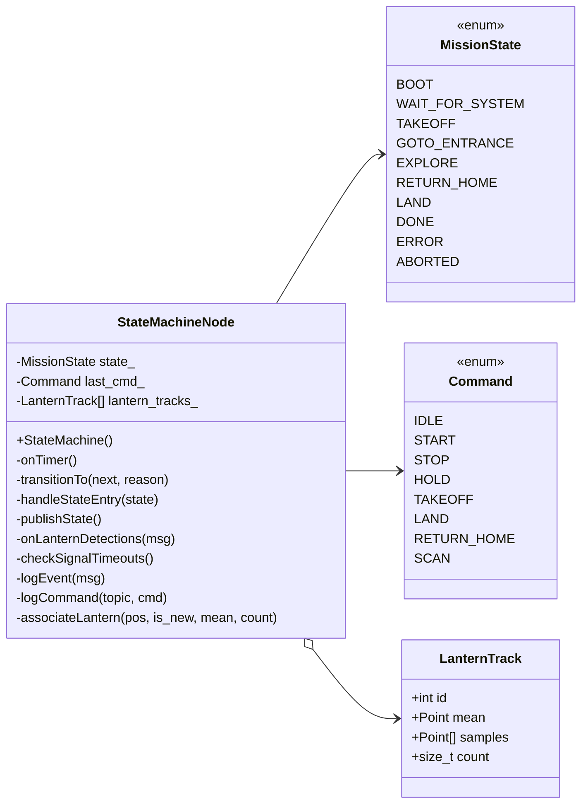

# Statemachine Redesign Draft (Class Diagram)

This document mirrors the topic wiring from the big flowchart in `README.md` (section 2.2.1) and
focuses on a class-level view of the statemachine package. No sequence diagram is included.

```mermaid
classDiagram
  direction LR

  class StateMachineNode {
    +StateMachine()
    -onTimer()
    -transitionTo(next, reason)
    -handleStateEntry(state)
    -publishState()
    -onLanternDetections(msg)
    -checkSignalTimeouts()
    -logEvent(msg)
    -logCommand(topic, cmd)
    -associateLantern(pos, is_new, mean, count)
    -MissionState state_
    -Command last_cmd_
    -LanternTrack[] lantern_tracks_
  }

  class LanternTrack {
    +int id
    +Point mean
    +Point[] samples
    +size_t count
  }

  class MissionState {
    <<enum>>
    BOOT
    WAIT_FOR_SYSTEM
    TAKEOFF
    GOTO_ENTRANCE
    EXPLORE
    RETURN_HOME
    LAND
    DONE
    ERROR
    ABORTED
  }

  class Command {
    <<enum>>
    IDLE
    START
    STOP
    HOLD
    TAKEOFF
    LAND
    RETURN_HOME
    SCAN
  }

  class BasicWaypointNode {
    <<node>>
    +sub cmd/basic_waypoint (UInt8)
    +pub basic_waypoint/done (Bool)
    +pub trajectory (PolynomialTrajectory4D)
  }

  class PathPlannerNode {
    <<node>>
    +sub cmd/path_planning (UInt8)
    +pub path_planning/ready (Bool)
    +pub path_planning/goal_reached (Bool)
    +pub trajectory (PolynomialTrajectory4D)
  }

  class MappingNode {
    <<node>>
    +sub cmd/mapping (UInt8)
    +pub mapping/ready (Bool)
  }

  class ControllerNode {
    <<node>>
    +sub cmd/controller (UInt8)
    +sub command/trajectory (MultiDOFJointTrajectory)
    +pub rotor_speed_cmds (Actuators)
  }

  class LanternDetectorNode {
    <<node>>
    +sub cmd/lantern_detector (UInt8)
    +pub detected_lanterns (PoseArray)
  }

  class TrajectorySamplerNode {
    <<node>>
    +sub trajectory (PolynomialTrajectory4D)
    +pub command/trajectory (MultiDOFJointTrajectory)
  }

  class UnityRos {
    <<node>>
    +pub /true_pose (PoseStamped)
    +pub /true_twist (TwistStamped)
    +sub TCP 9999 (commands)
  }

  class UnityState {
    <<node>>
    +pub current_state_est (Odometry)
  }

  class StateEstimateCorruptor {
    <<node>>
    +sub /true_pose (PoseStamped)
    +sub /true_twist (TwistStamped)
    +pub /current_state_est (Odometry)
  }

  class WToUnity {
    <<node>>
    +sub rotor_speed_cmds (Actuators)
    +pub UDP 12346
  }

  class Simulation {
    <<sim>>
    +pub TCP 9998 (sensor stream)
    +pub TCP 12347
  }

  class Topic_statemachine_state {
    <<topic>>
    type: std_msgs/String
  }
  class Topic_cmd_basic_waypoint {
    <<topic>>
    type: std_msgs/UInt8
  }
  class Topic_cmd_path_planning {
    <<topic>>
    type: std_msgs/UInt8
  }
  class Topic_cmd_mapping {
    <<topic>>
    type: std_msgs/UInt8
  }
  class Topic_cmd_controller {
    <<topic>>
    type: std_msgs/UInt8
  }
  class Topic_cmd_lantern_detector {
    <<topic>>
    type: std_msgs/UInt8
  }
  class Topic_mapping_ready {
    <<topic>>
    type: std_msgs/Bool
  }
  class Topic_path_ready {
    <<topic>>
    type: std_msgs/Bool
  }
  class Topic_waypoint_done {
    <<topic>>
    type: std_msgs/Bool
  }
  class Topic_goal_reached {
    <<topic>>
    type: std_msgs/Bool
  }
  class Topic_detected_lanterns {
    <<topic>>
    type: geometry_msgs/PoseArray
  }
  class Topic_trajectory_poly {
    <<topic>>
    type: mav_planning_msgs/PolynomialTrajectory4D
  }
  class Topic_trajectory_cmd {
    <<topic>>
    type: trajectory_msgs/MultiDOFJointTrajectory
  }
  class Topic_current_state_est {
    <<topic>>
    type: nav_msgs/Odometry
  }
  class Topic_true_pose {
    <<topic>>
    type: geometry_msgs/PoseStamped
  }
  class Topic_true_twist {
    <<topic>>
    type: geometry_msgs/TwistStamped
  }
  class Topic_rotor_speed_cmds {
    <<topic>>
    type: mav_msgs/Actuators
  }

  StateMachineNode --> MissionState
  StateMachineNode --> Command
  StateMachineNode o--> LanternTrack

  StateMachineNode --> Topic_cmd_basic_waypoint : publishes
  Topic_cmd_basic_waypoint --> BasicWaypointNode : subscribes

  StateMachineNode --> Topic_cmd_path_planning : publishes
  Topic_cmd_path_planning --> PathPlannerNode : subscribes

  StateMachineNode --> Topic_cmd_mapping : publishes
  Topic_cmd_mapping --> MappingNode : subscribes

  StateMachineNode --> Topic_cmd_controller : publishes
  Topic_cmd_controller --> ControllerNode : subscribes

  StateMachineNode --> Topic_cmd_lantern_detector : publishes
  Topic_cmd_lantern_detector --> LanternDetectorNode : subscribes

  StateMachineNode --> Topic_statemachine_state : publishes

  MappingNode --> Topic_mapping_ready : publishes
  Topic_mapping_ready --> StateMachineNode : subscribes

  PathPlannerNode --> Topic_path_ready : publishes
  Topic_path_ready --> StateMachineNode : subscribes

  PathPlannerNode --> Topic_goal_reached : publishes
  Topic_goal_reached --> StateMachineNode : subscribes

  BasicWaypointNode --> Topic_waypoint_done : publishes
  Topic_waypoint_done --> StateMachineNode : subscribes

  LanternDetectorNode --> Topic_detected_lanterns : publishes
  Topic_detected_lanterns --> StateMachineNode : subscribes

  BasicWaypointNode --> Topic_trajectory_poly : publishes
  PathPlannerNode --> Topic_trajectory_poly : publishes
  Topic_trajectory_poly --> TrajectorySamplerNode : subscribes

  TrajectorySamplerNode --> Topic_trajectory_cmd : publishes
  Topic_trajectory_cmd --> ControllerNode : subscribes

  UnityRos --> Topic_true_pose : publishes
  UnityRos --> Topic_true_twist : publishes
  Topic_true_pose --> StateEstimateCorruptor : subscribes
  Topic_true_twist --> StateEstimateCorruptor : subscribes
  StateEstimateCorruptor --> Topic_current_state_est : publishes
  Topic_current_state_est --> BasicWaypointNode : subscribes
  UnityState --> Topic_current_state_est : publishes
  Topic_current_state_est --> ControllerNode : subscribes

  ControllerNode --> Topic_rotor_speed_cmds : publishes
  Topic_rotor_speed_cmds --> WToUnity : subscribes
  WToUnity --> Simulation : UDP 12346
  Simulation --> UnityState : TCP 12347
  Simulation --> UnityRos : TCP 9998
  UnityRos --> Simulation : TCP 9999
```

## Statemachine-Only Class Diagram

